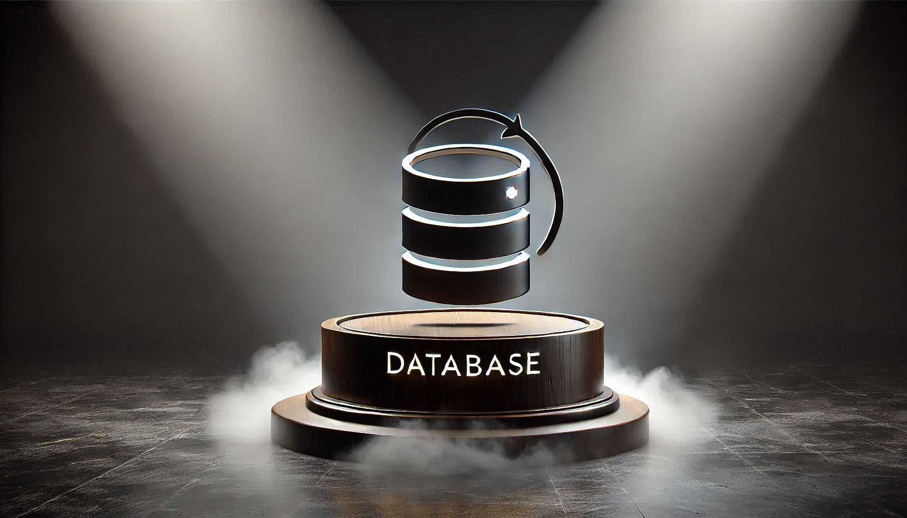

<h1 id="top" align="center">Database Initializer <br/> Alpine PostgreSQL Client</h1>

<br>

<div align="center">
    
</div>

<br>

## 🔍 Table of Contents

- [About Project](#intro)
- [Technologies](#technologies)
- [Features](#features)
- [Releases](#releases)
- [System Startup](#system-startup)
- [Contributors](#contributors)

<br/>

<h2 id="intro">📌 About Project</h2>

Database Initializer project provides a dockerized solution for initializing PostgreSQL databases with provided multiple schemas and seed data. It is particularly designed for development and testing processes, ensuring a consistent and reproducible database environment.

<br/>

<h2 id="technologies">☄️ Technologies</h2>

&nbsp; [](https://www.docker.com/)

&nbsp; [](https://alpinelinux.org/)

&nbsp; [](https://www.postgresql.org/)

<br/>

<h2 id="features">🔥 Features</h2>

- **Docker Containerization:** The application is containerized using Docker to ensure consistent deployment, scalability, and isolation across different environments.
- **Docker Compose Deployment:** Simplifies deployment with Docker Compose configuration, enabling easy setup and service orchestration without complex commands.
- **Network Compatibility:** Uses shared Docker network to work with other services.
- **Database Initialization:** Automatically sets up the PostgreSQL database schema and loads seed data during container startup.
- **pgAdmin Backup:** Exports from pgAdmin are stored in the bind mount directory `/backup` for easy access and management.
- **Lightweight Alpine Base:** Built using an Alpine Linux base for minimal image size and faster startup.
- **Felxibility:** Easily modify the default schema and data by updating SQL scripts in the project.
- **.env Configuration:** All environment variables are easily configurable using the `.env` file, simplifying configuration management.

<br/>

<h2 id="releases">🚢 Releases</h2>

&nbsp; [](https://github.com/ahmettoguz/database-initializer-postgresql/tree/v2.0.2)

&nbsp; [](https://github.com/ahmettoguz/database-initializer-postgresql/tree/v2.0.1)

&nbsp; [](https://github.com/ahmettoguz/database-initializer-postgresql/tree/v2.0.0)

&nbsp; [](https://github.com/ahmettoguz/core-database-initializer-alpine-postgresql-client/tree/v1.1.1)

&nbsp; [](https://github.com/ahmettoguz/core-database-initializer-alpine-postgresql-client/tree/v1.1.0)

&nbsp; [](https://github.com/ahmettoguz/core-database-initializer-alpine-postgresql-client/tree/v1.0.0)

<br/>

<h2 id="system-startup">🚀 System Startup</h2>

- Refer to [`PostgreSQL`](https://github.com/ahmettoguz/database-postgresql) repository to launch PostgreSQL database.

- Refer to [`pgAdmin`](https://github.com/ahmettoguz/database-pgadmin) repository to launch pgAdmin to interact with database using GUI.

- Create a new directory named `database`.

```
mkdir database
cd database
```

- Clone project.

```
git clone https://github.com/ahmettoguz/database-initializer-postgresql
cd database-initializer-postgresql
```

- Create `.env` file based on the `.env.example` file with credentails.

```
cp .env.example .env
```

- Export the SQL script using the `pgAdmin` interface or provide an existing SQL script.

- Create `sql` directory based on the `sql.example` directory.

- Replace the `init.sql` file with your custom SQL script to initialize the database schema and seed data.

- If there is more than one SQL script, place all scripts in the `sql` directory and update the `Dockerfile` by uncommenting the line with the correct file name.

- Include following code block at the beginning of the SQL script to terminate all connections from database to be able to re-initialize it.

```
DO $$
BEGIN
    PERFORM pg_terminate_backend(pg_stat_activity.pid)
    FROM pg_stat_activity
    WHERE pg_stat_activity.datname = '<DATABASE_NAME>' AND pid <> pg_backend_pid();
END;
$$;
```

- Clean sql file from comments with following regex

```
^--.*\n{1,}
```

- Create `network-database` network if not exists.

```
docker network create network-database
```

- Run container.

```
docker stop                              database-initializer-postgresql-c
docker rm                                database-initializer-postgresql-c
docker compose -p database up -d --build database-initializer-postgresql
docker logs -f                           database-initializer-postgresql-c
```

<br/>

<h2 id="contributors">👥 Contributors</h2>

<a href="https://github.com/ahmettoguz" target="_blank"></a>

### [🔝](#top)
